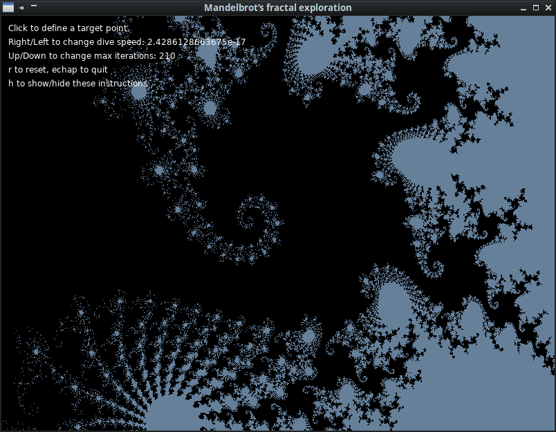
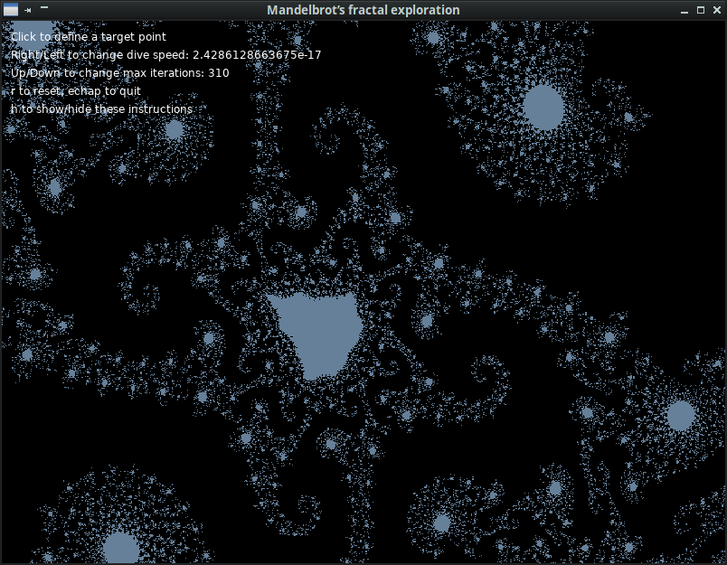
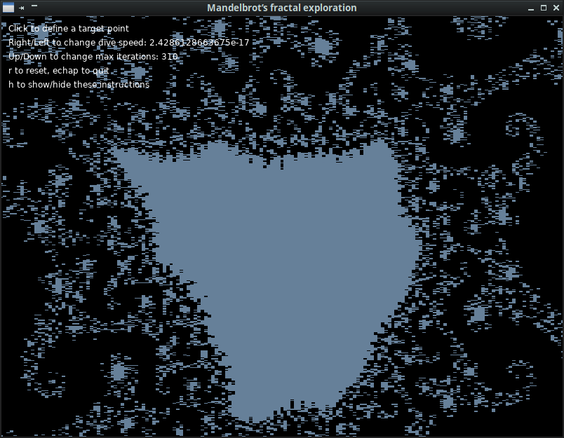

# MandelbrotFractalExplo-Shaders
Simple viz tool to explore Mandelbrot’s fractal - this version use a shader (GLSL).

Shader usage leads to a trade-off : animation and controls are much smoother in this version, but limitation in GPU’s high precision floating point calculations forbids zooming in too deeply. 
Exemple images (to compare with [this version without shader](https://github.com/Jehadel/MandelbrotFractalExplo)) :

---

## TO DO

Add colors